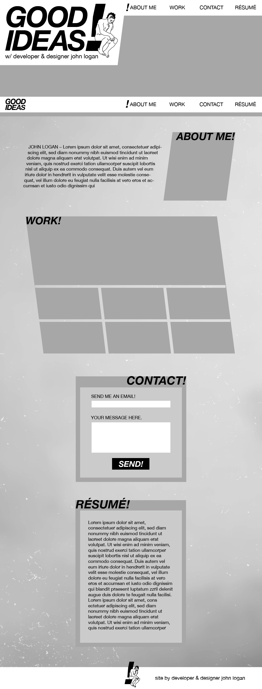
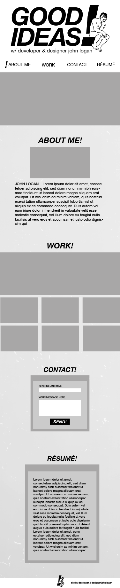

# Goodideas

This web project is a portfolio site in attempts to show my work to future clients/employers.

## Goals

The goal of this project (as of 6.5.22) is to present and push my abilities within HTML & CSS.

Attempts will be made to create something that looks unique. Current CSS knowledge will be pushed by opting for more difficult styling (gifs, slanted presentation options, higher graphic complexity).

## Models
 

 

 ### This site made by John Logan